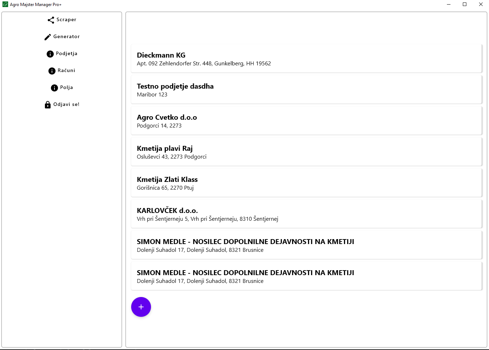
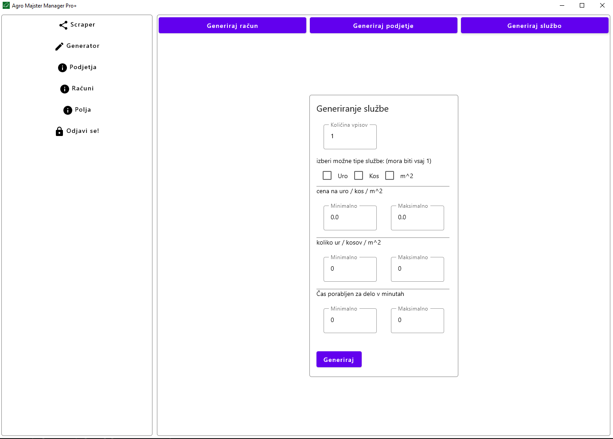
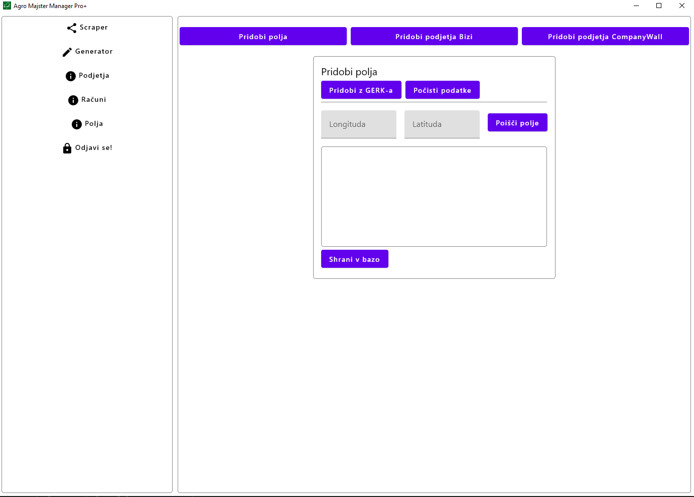
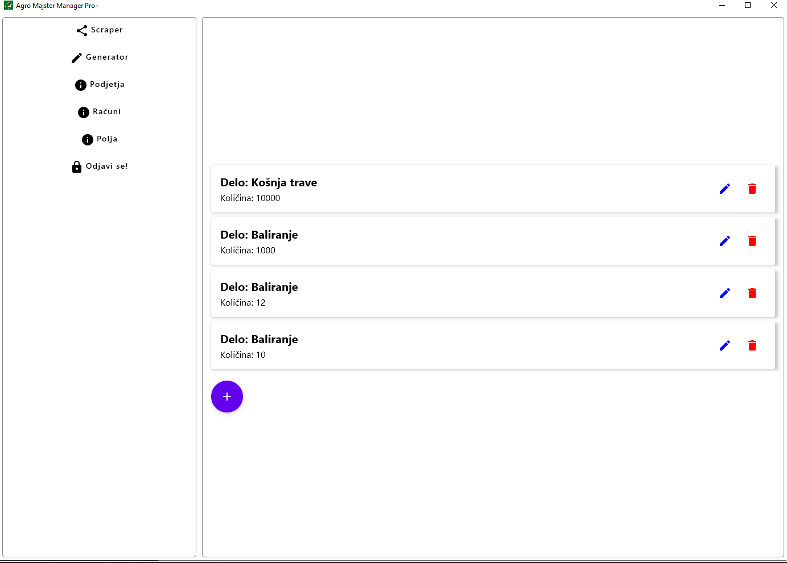

# About Agro Majster Desktop Pro+

Agro Majster Desktop Pro+ is a desktop app for managing data for the [Agro Majster rest server](https://github.com/Seljaki/server).

|  |  |
|------------------------|------------------------|
|  |  |


## Prerequisites

To build and run this software you will need:  
- [Agro Majster rest server](https://github.com/Seljaki/server)  
- Gradle version 8+
- Java version 18

## Configuring and running the app

1. Open the project in IntelliJ
2. Run the Desktop config

## Building the app

Run ```./gradlew build```
